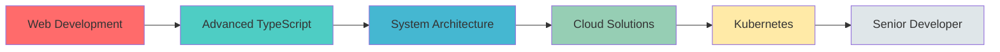

<div align="center">


<p align="center">
  <a href="LINK_TO_YOUR_LINKEDIN_PROFILE">
    
  </a>
  <a href="mailto:matanguihanralph@gmail.com">
    
  </a>
  <a href="https://github.com/CHUNINZ">
    
  </a>
  <a href="YOUR_PORTFOLIO_URL">
    
  </a>
</p>


</div>

---


##  About Me

```typescript
const ralph: Developer = {
    name: "Ralph Matanguihan",
    role: "Full-Stack Developer",
    location: "Manila, Philippines 🇵🇭",
    
    languages: ["JavaScript", "TypeScript", "PHP", "Python", "SQL"],
    
    currentlyLearning: [
        "Advanced TypeScript Patterns",
        "Microservices Architecture", 
        "Docker & Kubernetes",
        "AWS Cloud Solutions"
    ],
    
    expertise: {
        frontend: ["React.js", "Next.js", "Tailwind CSS", "Redux"],
        backend: ["Node.js", "Express", "Laravel", "RESTful APIs"],
        database: ["MySQL", "MongoDB", "PostgreSQL", "Redis"],
        devOps: ["Docker", "Git", "CI/CD", "Linux"]
    },
    
    workingOn: "Building scalable web applications with modern architecture",
    funFact: "I debug with console.log() and I'm not ashamed! 😄",
    
    getMotivation: () => {
        return "Turning coffee ☕ into code 💻, one commit at a time!";
    }
};
```

### 🎯 What I Do

- 🔭 **Currently Building:** Enterprise-level web applications with focus on performance and scalability
- 💡 **Specialization:** Full-stack development with expertise in MERN/MEVN stack
- 🌱 **Learning Journey:** Advancing skills in cloud architecture, containerization, and system design
- 👯 **Collaboration:** Actively seeking opportunities to contribute to impactful open-source projects
- 🤝 **Community:** Helping fellow developers through code reviews and technical discussions
- 💬 **Ask Me About:** Web development, API design, database optimization, or anything tech!
- ⚡ **Philosophy:** Write clean code, test thoroughly, deploy confidently

---

## 🛠️ Technology Stack & Tools

<div align="center">

### 💻 Frontend Technologies
<p>
  
</p>

### ⚙️ Backend Technologies
<p>
  
</p>

### 🗄️ Databases & Cloud
<p>
  
</p>

### 🔧 DevOps & Tools
<p>
  
</p>

### 📱 Additional Skills
<p>
  
</p>

</div>

---

## 📊 GitHub Statistics

<div align="center">
  
  
</div>

<div align="center">
  
  
</div>


---

## 🏆 GitHub Achievements

<div align="center">
  
</div>

---

## 💼 Featured Projects

<div align="center">

<table>
<tr>
<td width="50%">
<h3 align="center">🚀 E-Commerce Platform</h3>
<div align="center">
<a href="YOUR_PROJECT_LINK" target="_blank">

</a>
<p><strong>React, Node.js, MongoDB, Stripe</strong></p>
<p>Full-featured e-commerce platform with payment integration, user authentication, admin dashboard, and real-time inventory management. Implemented RESTful APIs and responsive design.</p>
</div>
</td>
<td width="50%">
<h3 align="center">📱 Social Media Dashboard</h3>
<div align="center">
<a href="YOUR_PROJECT_LINK" target="_blank">

</a>
<p><strong>Next.js, TypeScript, PostgreSQL</strong></p>
<p>Analytics dashboard with real-time data visualization, user engagement metrics, and automated reporting. Features include JWT authentication and role-based access control.</p>
</div>
</td>
</tr>

<tr>
<td width="50%">
<h3 align="center">🎨 Portfolio Builder SaaS</h3>
<div align="center">
<a href="YOUR_PROJECT_LINK" target="_blank">

</a>
<p><strong>React, Express, MySQL, AWS</strong></p>
<p>SaaS platform allowing users to create and customize professional portfolios with drag-and-drop interface. Integrated cloud storage and deployment automation.</p>
</div>
</td>
<td width="50%">
<h3 align="center">⚡ Real-Time Chat Application</h3>
<div align="center">
<a href="YOUR_PROJECT_LINK" target="_blank">

</a>
<p><strong>Socket.io, Node.js, Redis, React</strong></p>
<p>Real-time messaging application with features like typing indicators, file sharing, group chats, and message encryption. Scalable architecture handling 1000+ concurrent users.</p>
</div>
</td>
</tr>
</table>

</div>

---

## 📈 Coding Activity

<div align="center">

<!--START_SECTION:waka-->
```text
💼 Current Project Stats

Total Repositories:    15+ projects
Total Commits:         500+ contributions
Code Reviews:          100+ reviews completed  
Pull Requests:         75+ merged PRs
Issues Solved:         50+ issues resolved

⏱️ Weekly Development Breakdown

JavaScript   12 hrs 30 mins  ████████████░░░░░░░░░   55.2%
TypeScript    4 hrs 15 mins  ████░░░░░░░░░░░░░░░░░   18.7%
HTML/CSS      3 hrs 45 mins  ███░░░░░░░░░░░░░░░░░░   16.5%
PHP           1 hr 30 mins   █░░░░░░░░░░░░░░░░░░░░    6.6%
Other         0 hrs 45 mins  ░░░░░░░░░░░░░░░░░░░░░    3.0%
```
<!--END_SECTION:waka-->

</div>

---

## 🎓 Professional Development

<div align="center">

| 🎯 Focus Area | 📊 Progress | 🔥 Status |
|--------------|-------------|-----------|
| **System Design** | ████████░░ 80% | 🚀 Advanced |
| **Cloud Architecture** | ███████░░░ 70% | 📈 Intermediate |
| **Microservices** | ██████░░░░ 60% | 🌱 Learning |
| **DevOps & CI/CD** | ████████░░ 75% | 💪 Proficient |
| **Web Performance** | █████████░ 85% | ⚡ Expert |

</div>

### 💡 Current Learning Path



---

## 🌟 Professional Principles

<div align="center">

<table>
<tr>
<td align="center" width="33%">

<br /><strong>Clean Code</strong>
<br />
<sub>Writing maintainable, readable, and scalable code following industry best practices and SOLID principles.</sub>
</td>
<td align="center" width="33%">

<br /><strong>Test-Driven</strong>
<br />
<sub>Implementing comprehensive testing strategies including unit, integration, and e2e tests for reliability.</sub>
</td>
<td align="center" width="33%">

<br /><strong>Team Player</strong>
<br />
<sub>Excellent communication skills with experience in Agile/Scrum methodologies and cross-functional teams.</sub>
</td>
</tr>
</table>

</div>

---

## 🎯 2025 Goals

- ✅ Master TypeScript advanced patterns and decorators
- 🔄 Build and deploy 3 production-grade full-stack applications
- 📚 Contribute to 10+ open-source projects
- 🎓 Obtain AWS Solutions Architect certification
- 🚀 Lead a development team on a major project
- 💡 Start a technical blog sharing development insights
- 🤝 Mentor junior developers in the community

---

## 📫 Let's Connect & Collaborate

<div align="center">

### 💬 I'm always excited to discuss:

<p>


</p>

### 🌐 Find Me Online

<p>
<a href="LINK_TO_YOUR_LINKEDIN_PROFILE"></a>
<a href="mailto:matanguihanralph@gmail.com"></a>
<a href="https://github.com/CHUNINZ"></a>
<a href="YOUR_TWITTER_URL"></a>
</p>

### ☕ Support My Work

<p>
<a href="YOUR_BUYMEACOFFEE_URL"></a>
<a href="YOUR_KOFI_URL"></a>
</p>

---

### 💭 Developer Quote


---

### 😄 Random Dev Humor

<div align="center">

</div>

---


<p align="center">


</p>

<p align="center">
  <strong>⭐️ Star my repositories if you find them interesting!</strong>
  <br/>
  <sub>Made with 💙 by Ralph Matanguihan</sub>
  <br/>
  <sub>© 2025 All rights reserved</sub>
</p>

</div>
