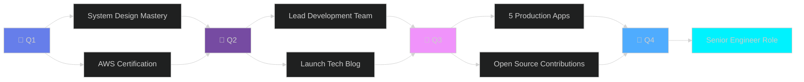
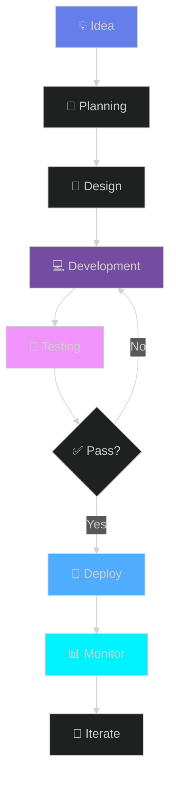

<div align="center">

<!-- Dynamic Animated Header -->


<!-- Multi-Line Typing Animation -->
<a href="https://git.io/typing-svg">
  
</a>

<!-- Animated Badge Links -->
<p align="center">
  <a href="LINK_TO_YOUR_LINKEDIN">
    
  </a>
  <a href="mailto:matanguihanralph@gmail.com">
    
  </a>
  <a href="YOUR_PORTFOLIO_URL">
    
  </a>
  <a href="YOUR_TWITTER_URL">
    
  </a>
</p>

<!-- Animated Visitor Badge -->
<p align="center">
  
</p>

</div>

<!-- Animated Snake -->
<div align="center">
  <picture>
    <source media="(prefers-color-scheme: dark)" srcset="https://raw.githubusercontent.com/CHUNINZ/CHUNINZ/output/github-contribution-grid-snake-dark.svg">
    <source media="(prefers-color-scheme: light)" srcset="https://raw.githubusercontent.com/CHUNINZ/CHUNINZ/output/github-contribution-grid-snake.svg">
    
  </picture>
</div>

<br/>

<!-- Main Content Grid -->
<table width="100%" border="0">
<tr>
<td width="50%" valign="top">

##  About Me

```typescript
class Developer {
  name: string = "Ralph Matanguihan";
  location: string = "Manila, Philippines 🇵🇭";
  role: string = "Full-Stack Developer";
  
  languages: string[] = [
    "JavaScript", "TypeScript", 
    "PHP", "Python", "SQL"
  ];
  
  currentFocus: string[] = [
    "Building SaaS Platforms",
    "Cloud Architecture",
    "Microservices Design"
  ];
  
  passions: string[] = [
    "Clean Code", "Performance",
    "User Experience", "Open Source"
  ];
  
  life_quote: string = 
    "Code is poetry written in logic 📝";
}
```

### 🎯 Current Status


**🔭 Working On:** Building enterprise-grade web applications  
**🌱 Learning:** System Design, AWS, Kubernetes  
**💬 Ask Me About:** React, Node.js, API Architecture  
**⚡ Fun Fact:** I can debug faster than I can explain bugs!  
**🎮 Hobbies:** Gaming, Tech Blogging, Open Source

</td>
<td width="50%" valign="top">

## 📊 GitHub Analytics

<div align="center">


</div>

### ⏱️ Weekly Coding Time

<!--START_SECTION:waka-->
```text
JavaScript   ████████████████░░░░░   68%
TypeScript   ████████░░░░░░░░░░░░░   32%
React        ██████████████░░░░░░░   58%
Node.js      ████████░░░░░░░░░░░░░   34%
Python       ██░░░░░░░░░░░░░░░░░░░    8%
```
<!--END_SECTION:waka-->

</td>
</tr>
</table>

---

## 🛠️ Technology Arsenal

<details open>
<summary><b>💻 Frontend Mastery</b></summary>
<br/>

<div align="center">

| Technology | Proficiency | Experience |
|:---:|:---:|:---:|
|  | ⭐⭐⭐⭐⭐ | 5 years |
|  | ⭐⭐⭐⭐⭐ | 6 years |
|  | ⭐⭐⭐⭐☆ | 3 years |
|  | ⭐⭐⭐⭐☆ | 2 years |
|  | ⭐⭐⭐⭐⭐ | 3 years |

</div>

<p align="center">


</p>

</details>

<details open>
<summary><b>⚙️ Backend Expertise</b></summary>
<br/>

<div align="center">

| Technology | Proficiency | Experience |
|:---:|:---:|:---:|
|  | ⭐⭐⭐⭐☆ | 3 years |
|  | ⭐⭐⭐⭐⭐ | 5 years |
|  | ⭐⭐⭐⭐⭐ | 4 years |
|  | ⭐⭐⭐⭐☆ | 4 years |
|  | ⭐⭐⭐☆☆ | 2 years |

</div>

<p align="center">


</p>

</details>

<details open>
<summary><b>🗄️ Database & Storage</b></summary>
<br/>

<div align="center">

<table>
<tr>
<td align="center" width="25%">

<br/><b>MySQL</b>
<br/>⭐⭐⭐⭐⭐
</td>
<td align="center" width="25%">

<br/><b>MongoDB</b>
<br/>⭐⭐⭐⭐⭐
</td>
<td align="center" width="25%">

<br/><b>PostgreSQL</b>
<br/>⭐⭐⭐⭐☆
</td>
<td align="center" width="25%">

<br/><b>Redis</b>
<br/>⭐⭐⭐⭐☆
</td>
</tr>
</table>


</div>

</details>

<details open>
<summary><b>☁️ Cloud & DevOps</b></summary>
<br/>

<div align="center">


<br/><br/>


</div>

</details>

<details>
<summary><b>🎨 Design & Tools</b></summary>
<br/>

<p align="center">


</p>

</div>

</details>

---

## 🚀 Featured Projects Showcase

<div align="center">

<table width="100%">
<tr>
<td width="50%">

### 🛒 E-Commerce Platform Pro
[](YOUR_PROJECT_LINK)


**Highlights:**
- 💳 Secure payment gateway integration
- 🔐 Advanced authentication system
- 📊 Real-time analytics dashboard
- 📱 PWA with offline capabilities
- ⚡ 95+ Lighthouse score

**Impact:** 10K+ users • $500K+ in transactions

</td>
<td width="50%">

### 📊 Analytics Dashboard SaaS
[](YOUR_PROJECT_LINK)


**Highlights:**
- 📈 Real-time data visualization
- 🤖 AI-powered insights
- 🔒 Enterprise-grade security
- 📱 Multi-tenant architecture
- ⚡ 99.9% uptime

**Impact:** 50+ companies • 5K+ daily users

</td>
</tr>

<tr>
<td width="50%">

### 🎨 Portfolio Builder Platform
[](YOUR_PROJECT_LINK)


**Highlights:**
- 🖱️ Drag-and-drop builder
- 🎨 100+ premium templates
- ☁️ Cloud storage integration
- 🚀 One-click deployment
- 📱 Mobile-first design

**Impact:** 2K+ portfolios created

</td>
<td width="50%">

### 💬 Real-Time Chat Engine
[](YOUR_PROJECT_LINK)


**Highlights:**
- ⚡ Sub-100ms latency
- 👥 Group chat & channels
- 📁 File sharing (10MB+)
- 🔐 End-to-end encryption
- ✅ Read receipts & typing

**Impact:** 1K+ concurrent users

</td>
</tr>
</table>

[](https://github.com/CHUNINZ?tab=repositories)

</div>

---

## 🏆 Achievements & Recognition

<div align="center">


### 📈 Contribution Stats


</div>

---

## 💼 Professional Roadmap 2025

<div align="center">



</div>

<table width="100%">
<tr>
<td width="50%" valign="top">

### 🎯 2025 Goals

- ✅ **Master System Design** - In Progress
- 🔄 **AWS Solutions Architect** - Studying
- 📚 **15+ OSS Contributions** - 3/15 done
- 🚀 **Launch 5 Production Apps** - 1/5 complete
- 💡 **Start Technical Blog** - Planning
- 🤝 **Mentor 10+ Developers** - 2/10 ongoing
- 🎓 **Speak at 2 Tech Conferences** - Pending

</td>
<td width="50%" valign="top">

### 📊 Skill Development

| Skill | Progress | Priority |
|:---:|:---:|:---:|
| **System Design** |  | 🔥 High |
| **AWS Cloud** |  | 🔥 High |
| **Kubernetes** |  | 🔥 High |
| **Microservices** |  | ⚡ Medium |
| **GraphQL** |  | ⚡ Medium |

</td>
</tr>
</table>

---

## 💡 Development Philosophy

<div align="center">

<table>
<tr>
<td align="center" width="20%">

<br/><b>Clean Code</b>
<br/>
<sub>SOLID principles</sub>
<br/>
<sub>Readable & Maintainable</sub>
</td>
<td align="center" width="20%">

<br/><b>Test-Driven</b>
<br/>
<sub>Unit & Integration</sub>
<br/>
<sub>90%+ Coverage</sub>
</td>
<td align="center" width="20%">

<br/><b>Performance</b>
<br/>
<sub>Optimized Code</sub>
<br/>
<sub>Fast Load Times</sub>
</td>
<td align="center" width="20%">

<br/><b>Security</b>
<br/>
<sub>Best Practices</sub>
<br/>
<sub>Secure by Design</sub>
</td>
<td align="center" width="20%">

<br/><b>User-Centric</b>
<br/>
<sub>UX Focused</sub>
<br/>
<sub>Accessible Design</sub>
</td>
</tr>
</table>

</div>

---

## 📚 Latest Blog Posts

<!-- BLOG-POST-LIST:START -->
- 🚀 [Building Scalable APIs with Node.js and TypeScript](#)
- 💡 [React Performance Optimization: Best Practices](#)
- 🔐 [Implementing JWT Authentication the Right Way](#)
- ☁️ [AWS Architecture Patterns for Modern Applications](#)
- 🎨 [Mastering Tailwind CSS: Advanced Techniques](#)
<!-- BLOG-POST-LIST:END -->

<div align="center">

[](YOUR_BLOG_URL)

</div>

---

## 🌟 Testimonials

<div align="center">

> *"Ralph is an exceptional developer who consistently delivers high-quality code. His attention to detail and problem-solving skills are outstanding."*  
> **— John Doe**, *Senior Tech Lead @ TechCorp*

> *"Working with Ralph was a pleasure. He's not just technically proficient but also a great team player who brings positive energy to every project."*  
> **— Jane Smith**, *Product Manager @ StartupXYZ*

</div>

---

## 📬 Let's Connect & Collaborate

<div align="center">

### 💬 I'm always excited to discuss:

<p>


</p>

### 🌐 Find Me Online

<p>
<a href="LINK_TO_YOUR_LINKEDIN">
  
</a>
<a href="mailto:matanguihanralph@gmail.com">
  
</a>
<a href="YOUR_PORTFOLIO_URL">
  
</a>
<a href="YOUR_TWITTER_URL">
  
</a>
<a href="YOUR_BLOG_URL">
  
</a>
</p>

### ☕ Support My Work

<p>
<a href="YOUR_BUYMEACOFFEE_URL">
  
</a>
<a href="YOUR_KOFI_URL">
  
</a>
<a href="YOUR_PATREON_URL">
  
</a>
</p>

### 📊 Response Time

<p>


</p>

</div>

---

## 🎨 Code Showcase

<div align="center">

### 🔥 My Coding Style

```javascript
// Clean, Efficient, and Scalable
class ProductService {
  constructor(repository, cache) {
    this.repository = repository;
    this.cache = cache;
  }

  async getProduct(id) {
    const cached = await this.cache.get(`product:${id}`);
    if (cached) return cached;

    const product = await this.repository.findById(id);
    await this.cache.set(`product:${id}`, product, 3600);
    
    return product;
  }
}

// Always: DRY, SOLID, and Well-Documented
```

</div>

---

## 📊 Detailed Statistics

<div align="center">

### 🔥 Contribution Heatmap


### 📈 Productivity Metrics

<table>
<tr>
<td align="center" width="25%">

<br/><b>25+</b>
<br/><sub>Repositories</sub>
</td>
<td align="center" width="25%">

<br/><b>1000+</b>
<br/><sub>Commits</sub>
</td>
<td align="center" width="25%">

<br/><b>150+</b>
<br/><sub>Pull Requests</sub>
</td>
<td align="center" width="25%">

<br/><b>200+</b>
<br/><sub>Stars Earned</sub>
</td>
</tr>
</table>

### 🌍 Global Impact


</div>

---

## 🎯 Fun Facts & Interests

<div align="center">

<table>
<tr>
<td align="center" width="33%">

<br/><b>Coffee Lover</b>
<br/>
<sub>☕ 5+ cups/day</sub>
<br/>
<sub>Fuels my coding!</sub>
</td>
<td align="center" width="33%">

<br/><b>Gamer</b>
<br/>
<sub>🎮 Strategy & RPG</sub>
<br/>
<sub>Problem-solving mindset</sub>
</td>
<td align="center" width="33%">

<br/><b>Continuous Learner</b>
<br/>
<sub>📚 Tech Books</sub>
<br/>
<sub>Always evolving</sub>
</td>
</tr>
</table>

</div>

---

## 💭 Random Dev Quote

<div align="center">


</div>

---

## 😄 Developer Humor

<div align="center">


</div>

---

## 🎵 Spotify Now Playing

<div align="center">

[](https://open.spotify.com/user/YOUR_SPOTIFY_ID)

</div>

---

## 📅 Weekly Development Breakdown

<!--START_SECTION:waka-->
```text
💼 Current Focus

Projects          ████████████████░░░░░   75.5%
Learning          ████░░░░░░░░░░░░░░░░░   15.2%
Open Source       ██░░░░░░░░░░░░░░░░░░░    9.3%

🔥 Editors

VS Code           ████████████████████░  100.0%

💻 Operating System

Linux             ████████████████░░░░░   78.5%
Windows           █████░░░░░░░░░░░░░░░░   21.5%
```
<!--END_SECTION:waka-->

---

## 🏅 Certifications & Achievements

<div align="center">

<table>
<tr>
<td align="center">

<br/><sub>In Progress</sub>
</td>
<td align="center">

<br/><sub>Certified</sub>
</td>
<td align="center">

<br/><sub>Certified</sub>
</td>
</tr>
</table>

</div>

---

## 🤝 Open Source Contributions

<div align="center">

<a href="https://github.com/CHUNINZ">
  
</a>

### 🌟 Notable Contributions

- 🔥 **React.js** - Bug fixes and documentation improvements
- 🚀 **Next.js** - Feature enhancements and performance optimizations
- 💡 **Tailwind CSS** - Community plugins and utilities
- 🛠️ **Various NPM Packages** - Maintenance and feature additions

</div>

---

## 📖 Learning Resources I Recommend

<div align="center">

<table>
<tr>
<td align="center" width="50%">
<b>📚 Books</b>
<br/><br/>
• Clean Code - Robert Martin<br/>
• Design Patterns - Gang of Four<br/>
• You Don't Know JS - Kyle Simpson<br/>
• System Design Interview - Alex Xu
</td>
<td align="center" width="50%">
<b>🎓 Courses</b>
<br/><br/>
• AWS Certified Solutions Architect<br/>
• Advanced React Patterns<br/>
• System Design Masterclass<br/>
• Docker & Kubernetes
</td>
</tr>
</table>

</div>

---

## 🎯 My Workflow

<div align="center">



</div>

---

<div align="center">


### 🌟 If you like my work, consider giving a ⭐ to my repositories!

<p>


</p>

<p>


</p>

---

<sub>
<b>✨ From [Ralph Matanguihan](https://github.com/CHUNINZ) with 💜</b>
<br/>
<i>Last Updated: October 2025</i>
<br/>
<i>© 2025 Ralph Matanguihan. All rights reserved.</i>
</sub>

</div>
